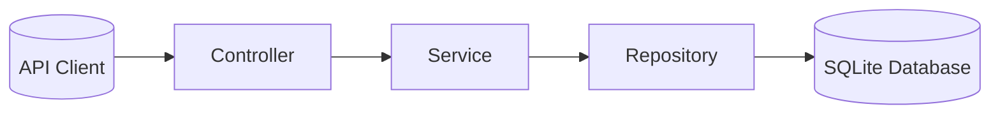

<h1 align="center">Eventshuffle</h1>

<p align="center">
  
  
  
  
  
  
</p>

<p align="center">
Kotlin + Spring Boot backend API for collaborative event scheduling.
<br>
Eventshuffle enables users to create events with possible dates, collect participant availability, and view the best matching dates, persisted using SQLite for durable storage.
</p>

> **Note:**<br>
> This project was developed as a **technical coding assignment** for **Futurice**.<br>
> The original task description and API specifications are included in [`INSTRUCTIONS.md`](INSTRUCTIONS.md).

## Development Stack

The following tools and versions are used during local development of the Eventshuffle project.

| Component       | Version / Description                                |
| --------------- | ---------------------------------------------------- |
| **Language**    | Kotlin 1.9.25                                        |
| **Framework**   | Spring Boot 3.5.6                                    |
| **JDK**         | Java 21.0.8 (Temurin)                                |
| **Build Tool**  | Gradle 8.14.3 (via included wrapper)                 |
| **Database**    | SQLite 3 (driver: `org.xerial:sqlite-jdbc:3.50.3.0`) |
| **ORM Dialect** | Hibernate 6.6.26.Final (community dialects)          |

## Requirements

To run Eventshuffle locally, you only need:

- **Java 21** (JDK 21 or newer)

Everything else (Gradle, Kotlin compiler, and SQLite database) is handled automatically by the included Gradle wrapper.

Optional tools for development:

- `curl` or Postman for testing API requests
- IntelliJ IDEA / VS Code for Kotlin development

## Getting Started

Clone and execute:

```bash
git clone https://github.com/TyostoKarry/Eventshuffle.git
cd Eventshuffle
./gradlew bootRun
```

This will start the backend at:

**http://localhost:8080**

On first launch, a local SQLite database file `eventshuffle.db` is created automatically in the project root.

## API Overview

| Purpose         | Method | Endpoint                     | Description                                |
| --------------- | ------ | ---------------------------- | ------------------------------------------ |
| List all events | GET    | `/api/v1/event/list`         | Returns all created events                 |
| Create event    | POST   | `/api/v1/event`              | Create a new event                         |
| Show event      | GET    | `/api/v1/event/{id}`         | Retrieve event details including votes     |
| Add vote        | POST   | `/api/v1/event/{id}/vote`    | Submit participant votes                   |
| Get results     | GET    | `/api/v1/event/{id}/results` | Return dates suitable for all participants |

## Example Requests and Responses

> **Note:**<br>
> The example curl commands below are provided in single‑line form for cross‑platform compatibility.<br>
> The accompanying JSON blocks illustrate the same request bodies for readability.

### List all events

Endpoint: `/api/v1/event/list`

#### Request

Method: `GET`

#### Response

Body:

```json
{
  "events": [
    {
      "id": 1,
      "name": "Jake's secret party"
    },
    {
      "id": 2,
      "name": "Bowling night"
    },
    {
      "id": 3,
      "name": "Tabletop gaming"
    }
  ]
}
```

#### Example curl

```bash
curl -X GET http://localhost:8080/api/v1/event/list
```

### Create an event

Endpoint: `/api/v1/event`

#### Request

Method: `POST`

Body:

```json
{
  "name": "Jake's secret party",
  "dates": ["2014-01-01", "2014-01-05", "2014-01-12"]
}
```

#### Response

Body:

```json
{
  "id": 1
}
```

#### Example curl

```bash
curl -X POST http://localhost:8080/api/v1/event -H "Content-Type: application/json" -d "{\"name\": \"Jake's secret party\", \"dates\": [\"2014-01-01\", \"2014-01-05\", \"2014-01-12\"]}"
```

### Show an event

Endpoint: `/api/v1/event/{id}`

#### Request

Method: `GET`

Parameters: `id`, `long`

#### Response

Body:

```json
{
  "id": 1,
  "name": "Jake's secret party",
  "dates": ["2014-01-01", "2014-01-05", "2014-01-12"],
  "votes": [
    {
      "date": "2014-01-01",
      "people": ["John", "Julia", "Paul", "Daisy"]
    }
  ]
}
```

#### Example curl

```bash
curl -X GET http://localhost:8080/api/v1/event/1
```

### Add votes to an event

Endpoint: `/api/v1/event/{id}/vote`

#### Request

Method: `POST`

Parameters: `id`, `long`

Body:

```json
{
  "name": "Dick",
  "votes": ["2014-01-01", "2014-01-05"]
}
```

#### Response

```json
{
  "id": 1,
  "name": "Jake's secret party",
  "dates": ["2014-01-01", "2014-01-05", "2014-01-12"],
  "votes": [
    {
      "date": "2014-01-01",
      "people": ["John", "Julia", "Paul", "Daisy", "Dick"]
    },
    {
      "date": "2014-01-05",
      "people": ["Dick"]
    }
  ]
}
```

#### Example curl

```bash
curl -X POST http://localhost:8080/api/v1/event/1/vote -H "Content-Type: application/json" -d "{\"name\": \"Dick\", \"votes\": [\"2014-01-01\", \"2014-01-05\"]}"
```

### Show the results of an event

Endpoint: `/api/v1/event/{id}/results`
Responds with dates that are **suitable for all participants**.

#### Request

Method: `GET`

Parameters: `id`, `long`

#### Response

```json
{
  "id": 1,
  "name": "Jake's secret party",
  "suitableDates": [
    {
      "date": "2014-01-01",
      "people": ["John", "Julia", "Paul", "Daisy", "Dick"]
    }
  ]
}
```

#### Example curl

```bash
curl -X GET http://localhost:8080/api/v1/event/1/results
```

## Data Persistence

Eventshuffle uses **SQLite** with **Spring Data JPA** and **Hibernate** for persistence.
All data (events and event votes) is stored locally in `eventshuffle.db` inside the repository root.

The persistence model consists of two main entities:

- **Event** – represents an event with its name and possible dates.
- **EventVote** – represents a participant’s availability for selected event dates.

Each entity is automatically mapped by Hibernate into database tables  
(`event`, `event_dates`, `event_vote`, and `event_vote_dates`),  
and relationships are maintained via JPA annotations.

The database schema is generated automatically — no manual configuration is required.

## Architecture Overview

Eventshuffle applies a layered architecture following  
**Controller → Service → Repository**, promoting clear separation of concerns.



Each layer has distinct responsibilities:

- Controllers handle HTTP input/output and map domain objects to DTOs
  - DTOs define the structure of client request and response models
- Services encapsulate business operations (e.g., saving events, handling votes)
- Repositories manage persistence with Spring Data JPA

While requests flow downward through these layers, responses propagate upward —
from repository results back through the service and controller layers, returning
API DTOs to the client.

## Continuous Integration

Every pull request to the `main` branch is automatically verified by a GitHub Actions workflow defined in [`.github/workflows/verify-pr.yml`](.github/workflows/verify-pr.yml).

The workflow performs the following checks:

1. Validates the Gradle wrapper integrity
2. Sets up JDK 21 using Temurin distribution
3. Runs `ktlintCheck` to ensure code style compliance
4. Runs all tests (`./gradlew test`)
5. Builds the project (`./gradlew assemble`)

This ensures that all pull requests are properly formatted, tested, and buildable before merging.

## Design Notes

- Clean architecture following **Controller → Service → Repository** structure
- DTOs define stable API boundaries
- Exception handling centralized with `GlobalExceptionHandler`
- Modular design easily extendable for authentication or alternative databases

## Future Additions

While the current implementation fully meets the functional requirements of the assignment, several enhancements could be introduced to evolve Eventshuffle into a more production-ready backend service.

- **Security and Authentication**  
  Add basic authentication or API key–based access control to prevent unauthorized event creation or voting.

- **Comprehensive KDoc and API Documentation**  
  Expand KDoc throughout the codebase, particularly for DTOs and service methods, to ensure consistent documentation coverage.<br>
  Introduce automated API documentation generation with **SpringDoc OpenAPI / Swagger UI**.

- **Integration and End‑to‑End Testing**  
  Extend test suite with integration tests verifying full API workflows against the SQLite persistence layer.

- **Deployment and Containerization**  
  Package the service as a Docker image and define a lightweight compose setup to simplify local and production deployments.

- **Frontend or API Client**  
  Develop a minimal web or mobile client consuming the REST endpoints to demonstrate usability and user flow.
